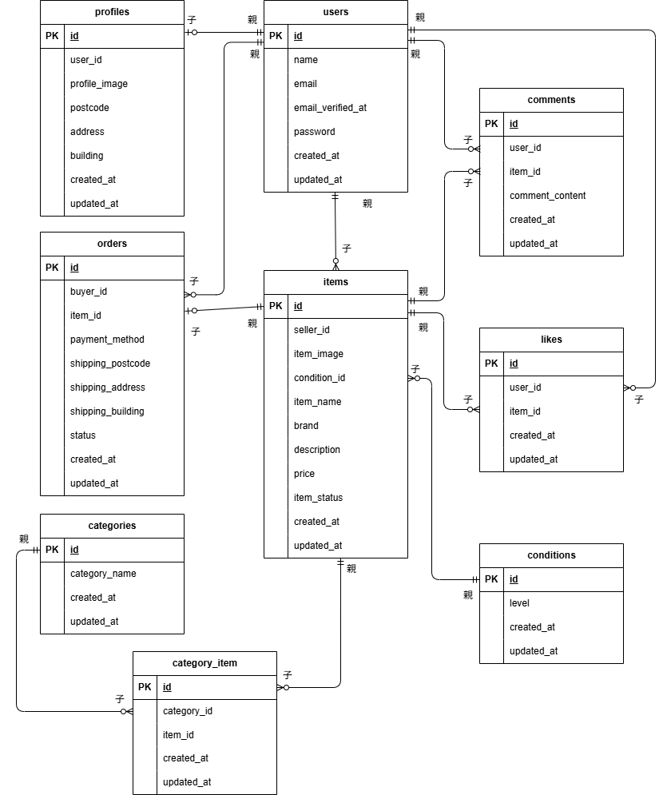

# フリマアプリ case__flea-market

## 環境構築

#### Docker ビルド

1. ファイルをクローン
   > git clone git@github.com:yuho-komahashi/case__flea-market.git
1. DockerDesktop 起動
1. docker-compose up -d --build

#### Laravel 環境構築

1. docker-compose exec php bash
1. composer install
1. 「.env.example」ファイルをコピーして「.env」ファイル作成、または新しく.env ファイルを作成
   > cp .env.example .env
1. 「.env」ファイルを以下に編集  
   > DB_CONNECTION=mysql  
   > DB_HOST=mysql  
   > DB_PORT=3306  
   > DB_DATABASE=laravel_db  
   > DB_USERNAME=laravel_user  
   > DB_PASSWORD=laravel_pass  
- メール認証には「mailhog」を使用 MAIL関連を以下に編集
   > MAIL_MAILER=smtp  
   > MAIL_HOST=mailhog  
   > MAIL_PORT=1025  
   > MAIL_USERNAME=null  
   > MAIL_PASSWORD=null  
   > MAIL_ENCRYPTION=null  
   > MAIL_FROM_ADDRESS=noreply@example.com  
   > MAIL_FROM_NAME="COACHTECH Fleamarket App"  
- 決済機能 stripe関連の設定 以下を最後に追記。キーは.envに追記してください。
   > STRIPE_KEY=pk_test_xxxx
   > STRIPE_SECRET=sk_test_xxxx 
   > SESSION_DOMAIN=localhost  
   > SESSION_SECURE_COOKIE=false  
5. アプリケーションキーの作成
   > php artisan key:generate
1. マイグレーションの実行
   > php artisan migrate
1. シーディングの実行
   > php artisan db:seed
1. シンボリックリンク作成
   > php artisan storage:link

### 使用技術(実行環境)

- Laravel 8
- PHP 8.1
- nginx:1.21.1
- Mysql 8.0.26
- mailhog
- JavaScript

### ER図

### URL

- 開発環境：http://localhost/
- phpMyAdmin：http://localhost:8080/
- mailhog：http://localhost:8025

### 主なページURL

- 商品一覧画面（トップ画面）：http://localhost/
- ログイン画面：http://localhost/login
- 会員登録画面：http://localhost/register
- 商品詳細画面：http://products/item/{item_id}
- プロフィール画面：http://localhost/mypage  
※その他については、提出資料の基本設計書をご参照ください

### テストユーザー情報(Seederで生成されるユーザー一覧)
- user_A  
ユーザー名：山口一郎  
メールアドレス：user_a@example.com  
パスワード：passyama11  

- user_B  
ユーザー名：伊藤雅子  
メールアドレス：user_b@example.com  
パスワード：passito22  

- user_C  
ユーザー名：坂本太郎  
メールアドレス：user_c@example.com  
パスワード：sakapass33  

- user_D  
ユーザー名：木村陽子  
メールアドレス：user_d@example.com  
パスワード：yokopass44 

### 補足

#### メール認証について
- メール認証には「mailhog」を使用しています。DockerコンテナにMailHogが含まれています。

#### 商品購入画面・支払い方法選択機能について
- 本アプリケーションでは、商品購入画面内「購入する」ボタンを押下し、stripe決済画面に接続することで「購入完了」としています（コーチと確認済み）。アプリへは、stripe画面からブラウザデフォルトの「戻るボタン」を使用して戻り、購入後の挙動を確認してください。
- 支払い方法の選択による小計表示の変更は、JavaScriptによってフロントエンドで動的に反映される仕様としています。  
当初は支払い方法の選択に応じてサーバー側で小計を再計算する仕様も検討しましたが、コーチ判断により、JSによる動的な反映で実装しています。

#### 画像保存について

- 支給された商品画像および、テストユーザーのプロフィール画像（こちらで用意）は src/storage/app/public/images に保存されています。
- .gitignore の初期設定で storage/ 配下は Git から除外されるため、storage/app/public/.gitignore を修正し、画像フォルダ（images/）を除外対象から外しました。
- プロジェクト環境構築後に、シンボリックリンクを作成してください。
  > php artisan storage:link
- コーチテックロゴ、いいねアイコン、コメントアイコン、プロフィールページのダミー画像（ユーザー画像）は素材のため、src/public/imagesに保存しています。

#### ビューの配置について
- 本アプリケーションでは教材やこれまでの確認テスト同様、src/配下にviewファイルを配置していますが、単体テスト時にエラーが発生しましたので、「config/view.php」の 「paths」に以下を追記しています。
   > 'paths' => [
      resource_path('views'),
      base_path('src/resources/views'),
   ],

#### usersテーブルについて
- 本アプリケーションでは Laravel Fortify を使用して認証機能を構築しています。  
そのため、usersテーブルには「remember_token」や「two_factor_*」などのカラムが含まれていますが、現時点では一部のカラムは未使用です。  
テスト実行時に必要なため「remember_token」は追加済みです。

## 単体テスト

### テスト環境
- テスト実行時は「.env.testing」を使用し、開発用DBとは分離された「demo_test」データベースを使用しています。  
テストにあたり下記を実行および、補足をご確認ください。

1. テスト用.envファイル作成  
- 「.env」ファイルをコピーして名前を「.env.testing」に修正  
   > docker-compose exec php bash  
   > cp .env .env.testing

- 冒頭のAPP_部分を下記に修正（APP_ENV,APP_KEYの2か所）  
   > APP_NAME=Laravel  
   > APP_ENV=testing  
   > APP_KEY=  
   > APP_DEBUG=true  
   > APP_URL=http://localhost  

- データベースの接続情報を修正（DB_DATABASE,DB_USERNAME,DB_PASSWORDの3か所）
   > DB_CONNECTION=mysql  
   > DB_HOST=mysql  
   > DB_PORT=3306  
   > DB_DATABASE=demo_test  
   > DB_USERNAME=root  
   > DB_PASSWORD=root  

2. キャッシュクリア および テスト用のアプリケーションキー作成
   > php artisan config:clear  
   > php artisan key:generate --env=testing  
    - 通常はキーは自動生成されますが、環境によっては .env.testing に反映されない場合があります。  
 その際は php artisan tinker でキーを確認し、手動で貼り付けてください  

3. テスト用テーブルの作成
   > php artisan migrate --env=testing  

4. オートロードを設定
   > composer dump-autoload
- 補足：教材やこれまでの確認テスト同様、このプロジェクトは src/ 配下にモデル・コントローラー・Factoryを配置していますが、単体テスト時にエラーが発生しましたので、Laravel標準仕様に沿うため、オートロード設定が必要です。Laravel に認識させるため、テスト前にコマンドを実行してください。  

5. テスト実行
- 本プロジェクトでは、開発用DBとテスト用DBを明確に分離するため、以下のコマンドでテストを実行してください。  
※.env.testing を作成済みですが、環境切り替えの都合上この指定が必要です。
   > APP_ENV=testing php artisan test  

#### テスト関連　補足
- 支払い方法の選択による小計表示の変更は、JavaScriptによってフロントエンドで動的に反映される仕様です。  
この挙動はLaravelのFeatureTestでは検証できないため、テスト対象外としています（手動での動作は確認済）。
なお、支払い方法の選択肢の表示や初期状態（未選択）の確認はFeatureTestで実施済みです。

- メール送信は Mailhog を使用して確認しています。  
FeatureTestでは、メール送信のトリガーと認証リンクのアクセスによるリダイレクトを確認しています。  
また、実際のメール受信・クリック操作は Mailhog上で手動確認しています。

以上