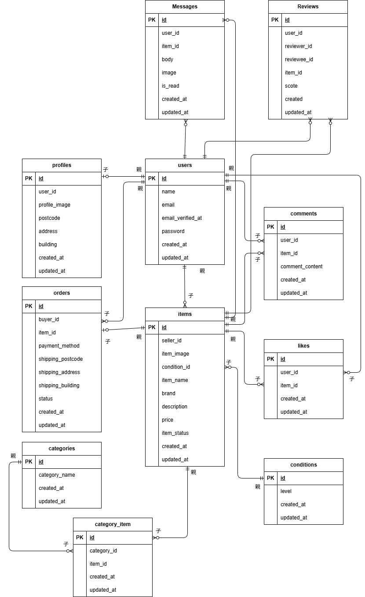

# フリマアプリ case\_\_flea-market（プロテスト提出用）

## 環境構築

#### Docker ビルド

1. ファイルをクローン
   > git clone git@github.com:yuho-komahashi/case\_\_flea-market-clean.git
1. DockerDesktop 起動
1. docker-compose up -d --build

#### Laravel 環境構築

1. docker-compose exec php bash
1. composer install
1. 「.env.example」ファイルをコピーして「.env」ファイル作成、または新しく.env ファイルを作成
   > cp .env.example .env
1. 「.env」ファイルを以下に編集
   > DB_CONNECTION=mysql  
   > DB_HOST=mysql  
   > DB_PORT=3306  
   > DB_DATABASE=laravel_db  
   > DB_USERNAME=laravel_user  
   > DB_PASSWORD=laravel_pass

- メール認証には「mailhog」を使用 MAIL関連を以下に編集
  > MAIL_MAILER=smtp  
  > MAIL_HOST=mailhog  
  > MAIL_PORT=1025  
  > MAIL_USERNAME=null  
  > MAIL_PASSWORD=null  
  > MAIL_ENCRYPTION=null  
  > MAIL_FROM_ADDRESS=noreply@example.com  
  > MAIL_FROM_NAME="COACHTECH Fleamarket App"
- 決済機能 stripe関連の設定 以下を最後に追記。キーは.envに追記してください。
  > STRIPE_KEY=pk_test_xxxx  
  > STRIPE_SECRET=sk_test_xxxx  
  > SESSION_DOMAIN=localhost  
  > SESSION_SECURE_COOKIE=false

5. アプリケーションキーの作成
   > php artisan key:generate
1. マイグレーションの実行
   > php artisan migrate
1. シーディングの実行
   > php artisan db:seed
1. シンボリックリンク作成
   > php artisan storage:link

### 使用技術(実行環境)

- Laravel 8
- PHP 8.1
- nginx:1.21.1
- Mysql 8.0.26
- mailhog
- JavaScript

## テーブル仕様

#### ■users

| カラム名          | 型              | primary key | unique key | not null | foreign key |
| ----------------- | --------------- | ----------- | ---------- | -------- | ----------- |
| id                | unsigned bigint | 〇          |            | 〇       |             |
| name              | varchar(20)     |             |            | 〇       |             |
| email             | varchar(255)    |             |            | 〇       |             |
| email_verified_at | timestamp       |             |            |          |             |
| password          | varchar(255)    |             |            | 〇       |             |
| rememberToken     | varchar(100)    |             |            |          |             |
| created_at        | timestamp       |             |            |          |             |
| updated_at        | timestamp       |             |            |          |             |

#### ■profiles

| カラム名      | 型              | primary key | unique key | not null | foreign key |
| ------------- | --------------- | ----------- | ---------- | -------- | ----------- |
| id            | unsigned bigint | 〇          |            | 〇       |             |
| user_id       | unsigned bigint |             |            | 〇       | users(id)   |
| profile_image | varchar(255)    |             |            | 〇       |             |
| postcode      | varchar(255)    |             |            | 〇       |             |
| address       | varchar(255)    |             |            | 〇       |             |
| building      | varchar(255)    |             |            |          |             |
| created_at    | timestamp       |             |            |          |             |
| updated_at    | timestamp       |             |            |          |             |

#### ■items

| カラム名     | 型              | primary key | unique key | not null | foreign key    |
| ------------ | --------------- | ----------- | ---------- | -------- | -------------- |
| id           | unsigned bigint | 〇          |            | 〇       |                |
| seller_id    | unsigned bigint |             |            | 〇       | users(id)      |
| item_image   | varchar(255)    |             |            | 〇       |                |
| condition_id | unsigned bigint |             |            | 〇       | conditions(id) |
| item_name    | varchar(255)    |             |            | 〇       |                |
| brand        | varchar(255)    |             |            |          |                |
| description  | varchar(255)    |             |            | 〇       |                |
| price        | int             |             |            | 〇       |                |
| item_status  | varchar(255)    |             |            | 〇       |                |
| created_at   | timestamp       |             |            |          |                |
| updated_at   | timestamp       |             |            |          |                |

#### ■categories

| カラム名      | 型              | primary key | unique key | not null | foreign key |
| ------------- | --------------- | ----------- | ---------- | -------- | ----------- |
| id            | unsigned bigint | 〇          |            | 〇       |             |
| category_name | varchar(255)    |             |            | 〇       |             |
| created_at    | timestamp       |             |            |          |             |
| updated_at    | timestamp       |             |            |          |             |

#### ■conditions

| カラム名   | 型              | primary key | unique key | not null | foreign key |
| ---------- | --------------- | ----------- | ---------- | -------- | ----------- |
| id         | unsigned bigint | 〇          |            | 〇       |             |
| level      | varchar(255)    |             |            | 〇       |             |
| created_at | timestamp       |             |            |          |             |
| updated_at | timestamp       |             |            |          |             |

#### ■likes

| カラム名   | 型              | primary key | unique key | not null | foreign key |
| ---------- | --------------- | ----------- | ---------- | -------- | ----------- |
| id         | unsigned bigint | 〇          |            | 〇       |             |
| user_id    | unsigned bigint |             |            | 〇       | users(id)   |
| item_id    | unsigned bigint |             |            | 〇       | items(id)   |
| created_at | timestamp       |             |            |          |             |
| updated_at | timestamp       |             |            |          |             |

#### ■comments

| カラム名        | 型              | primary key | unique key | not null | foreign key |
| --------------- | --------------- | ----------- | ---------- | -------- | ----------- |
| id              | unsigned bigint | 〇          |            | 〇       |             |
| user_id         | unsigned bigint |             |            | 〇       | users(id)   |
| item_id         | unsigned bigint |             |            | 〇       | items(id)   |
| comment_content | varchar(255)    |             |            | 〇       |             |
| created_at      | timestamp       |             |            |          |             |
| updated_at      | timestamp       |             |            |          |             |

#### ■orders

| カラム名          | 型              | primary key | unique key | not null | foreign key |
| ----------------- | --------------- | ----------- | ---------- | -------- | ----------- |
| id                | unsigned bigint | 〇          |            | 〇       |             |
| buyer_id          | unsigned bigint |             |            | 〇       | users(id)   |
| item_id           | unsigned bigint |             |            | 〇       | items(id)   |
| payment_method    | varchar(255)    |             |            | 〇       |             |
| shipping_postcode | varchar(255)    |             |            | 〇       |             |
| shipping_address  | varchar(255)    |             |            | 〇       |             |
| shipping_building | varchar(255)    |             |            |          |             |
| status            | varchar(255)    |             |            | 〇       |             |
| created_at        | timestamp       |             |            |          |             |
| updated_at        | timestamp       |             |            |          |             |

#### ■category_item

| カラム名    | 型              | primary key | unique key | not null | foreign key    |
| ----------- | --------------- | ----------- | ---------- | -------- | -------------- |
| id          | unsigned bigint | 〇          |            | 〇       |                |
| category_id | unsigned bigint |             |            | 〇       | categories(id) |
| item_id     | unsigned bigint |             |            | 〇       | items(id)      |
| created_at  | timestamp       |             |            |          |                |
| updated_at  | timestamp       |             |            |          |                |

#### ■messages（プロテスト用に追加）

| カラム名   | 型              | primary key | unique key | not null | foreign key |
| ---------- | --------------- | ----------- | ---------- | -------- | ----------- |
| id         | unsigned bigint | 〇          |            | 〇       |             |
| user_id    | unsigned bigint |             |            | 〇       | users(id)   |
| item_id    | unsigned bigint |             |            | 〇       | items(id)   |
| body       | text            |             |            | 〇       |             |
| image      | varchar(255)    |             |            |          |             |
| is_read    | boolean         |             |            | 〇       |             |
| created_at | timestamp       |             |            |          |             |
| updated_at | timestamp       |             |            |          |             |

#### ■reviews（プロテスト用に追加）

| カラム名    | 型              | primary key | unique key | not null | foreign key |
| ----------- | --------------- | ----------- | ---------- | -------- | ----------- |
| id          | unsigned bigint | 〇          |            | 〇       |             |
| reviewer_id | unsigned bigint |             |            | 〇       | users(id)   |
| reviewee_id | unsigned bigint |             |            | 〇       | users(id)   |
| item_id     | unsigned bigint |             |            | 〇       | items(id)   |
| score       | tinyint         |             |            | 〇       |             |
| created_at  | timestamp       |             |            |          |             |
| updated_at  | timestamp       |             |            |          |             |

### ER図

## ページ情報

### URL

- 開発環境：http://localhost/
- phpMyAdmin：http://localhost:8080/
- mailhog：http://localhost:8025

### 主なページURL

#### 模擬案件共通

- 商品一覧画面（トップ画面）：http://localhost/
- ログイン画面：http://localhost/login
- 会員登録画面：http://localhost/register
- 商品詳細画面：http://products/item/{item_id}
- プロフィール画面：http://localhost/mypage

#### プロテスト用追加

- プロフィール画面_取引中の商品：http://localhost/mypage?page=trading
- 取引中チャット画面：http://localhost/mypage/trading/{order}/chat

### テストユーザー情報(Seederで生成されるユーザー一覧)

- user_A（出品者・購入者）  
  ユーザー名：山口一郎  
  メールアドレス：user_a@example.com  
  パスワード：passyama11

- user_B（出品者・購入者）  
  ユーザー名：伊藤雅子  
  メールアドレス：user_b@example.com  
  パスワード：passito22

- user_C（設定なし・非取引ユーザー）  
  ユーザー名：坂本太郎  
  メールアドレス：user_c@example.com  
  パスワード：sakapass33

- user_D（設定なし・非取引ユーザー）  
  ユーザー名：木村陽子  
  メールアドレス：user_d@example.com  
  パスワード：yokopass44

※（プロテスト用）本アプリではユーザーA・Bを出品者、ユーザーCを非取引ユーザーとして使用しています。  
模擬案件ではユーザーDも存在していたため、取引に関係しない「いいね」「コメント」などのデータにはユーザーDが残っています。  
今回の課題要件（3ユーザー構成）には影響しないため、そのまま使用しています。

### 補足

#### メール認証について

- メール認証には「mailhog」を使用しています。DockerコンテナにMailHogが含まれています。

#### 商品購入画面・支払い方法選択機能について

- 本アプリケーションでは、商品購入画面内「購入する」ボタンを押下し、stripe決済画面に接続することで「購入完了」としています（コーチと確認済み）。アプリへは、stripe画面からブラウザデフォルトの「戻るボタン」を使用して戻り、購入後の挙動を確認してください。
- 支払い方法の選択による小計表示の変更は、JavaScriptによってフロントエンドで動的に反映される仕様としています。  
  当初は支払い方法の選択に応じてサーバー側で小計を再計算する仕様も検討しましたが、コーチ判断により、JSによる動的な反映で実装しています。

#### 画像保存について

- 支給された商品画像および、テストユーザーのプロフィール画像（こちらで用意）は src/storage/app/public/images に保存されています。
- .gitignore の初期設定で storage/ 配下は Git から除外されるため、storage/app/public/.gitignore を修正し、画像フォルダ（images/）を除外対象から外しました。
- プロジェクト環境構築後に、シンボリックリンクを作成してください。
  > php artisan storage:link
- コーチテックロゴ、いいねアイコン、コメントアイコン、プロフィールページのダミー画像（ユーザー画像）、評価の★アイコンは素材のため、src/public/imagesに保存しています。

#### ビューの配置について

- 本アプリケーションでは教材やこれまでの確認テスト同様、src/配下にviewファイルを配置していますが、単体テスト時にエラーが発生しましたので、「config/view.php」の 「paths」に以下を追記しています。
  > 'paths' => [
      resource_path('views'),
      base_path('src/resources/views'),
  ],

#### usersテーブルについて

- 本アプリケーションでは Laravel Fortify を使用して認証機能を構築しています。  
  そのため、usersテーブルには「remember*token」や「two_factor*\*」などのカラムが含まれていますが、現時点では一部のカラムは未使用です。  
  テスト実行時に必要だったため「remember_token」は追加済みです。

#### その他
- 機能要件についてはすべて実装済ですが、残念ながら時間不十分のため、細部まで確認しきれていない箇所が多々あると思われます。ご了承ください。  
#### ※単体テストについては模擬案件用、プロテストでは実施なしのため削除

以上
